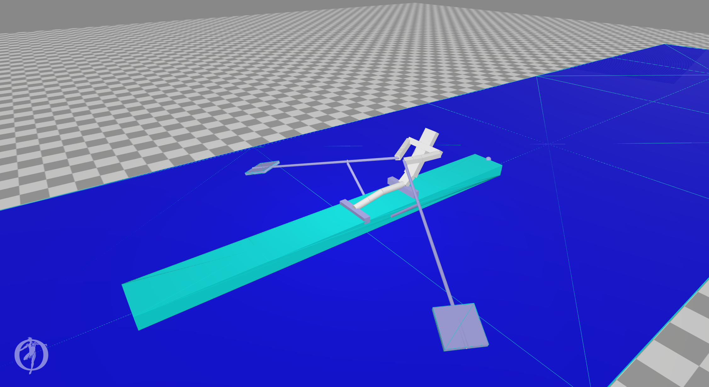

# Rowing software

Here my attemps at creating a rowing simulator.
The first, failed, attempt was done using gazebo with ROS.

The next attempts use OpenSim.

## Pusher

Contains the simplest version of a "leg" pushing a boat through the water. Well, actually the boat is a box on the ground an friction is used
to simulate the water.
Both IK-tool and CMC-tool work, the video is the CMC tool in action.

https://github.com/SietseAchterop/Rowing-simulator/blob/master/Pusher/pusher_CMC_video.mp4

There also is a version with muscles.

## BootBaan0

First working version with partial person.

## BootBaan1

First complete person without friction in the blades
Work in progress

## BootBaan2

Firt complete person with friction in the blade. Our first rower in action!
Work in progress

## BootBaan

Contains a first version of a boat with a rower. No muscles yet, only actuators on the joints.

  - Osim and trc files are created via the python scripts.
  - The mot file is created using the IK tool.

## Patches-opensim

To model a blade in water a new force, BladeForce, was created, a variant of the ElasticFoundationForce of Simbody.
With BladeForce friction is dependant upon the angle between the blade and the speed of the blade in the water.
The parameters set the friction perpendicular to the blade and friction in line with the blade is set very low in BladeForce.

Also a script to create opensim from source on debian and ubuntu is included.
