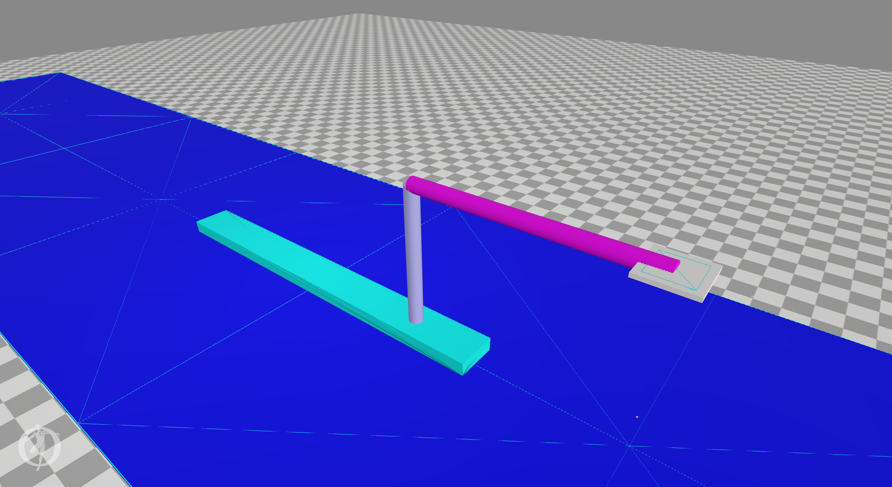

# Rowing software

Here my attemps at creating a rowing simulator.
The first, failed, attempt was done using gazebo with ROS.

The next attempts use OpenSim.

## Pusher

Contains the simplest version of a "leg" pushing a boat through the water. Well, actually the boat is a box on the ground an friction is used
to simulate the water.

The IK-tool and CMC-tool work, see the webm-file voor the pusher in action.

## BootBaan

Contains a first version of a boat with a rower. No muscles yet, only actuators on the joints.

  - Osim and trc files are created via the python scripts.
  - The mot file is created using the IK tool with all the boatjoints fixed to zero.
  - The IK-tool works, see the webm-file for the bootbaan in action
  - Regrettable the CMC-tool does not work yet.