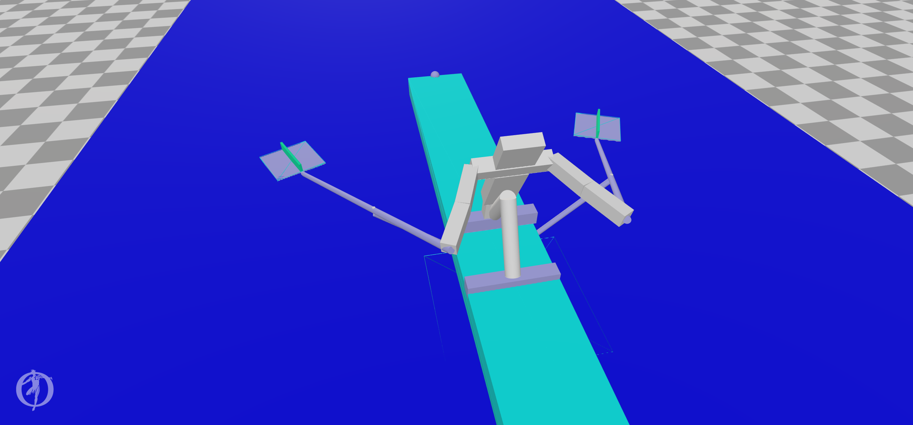

# Rowing software

Here my attemps at creating a rowing simulator.
The first, failed, attempt was done using gazebo with ROS.

The next attempts use OpenSim.

## Pusher

Contains the simplest version of a "leg" pushing a boat through the water. Well, actually the boat is a box on the ground an friction is used
to simulate the water.
Both IK-tool and CMC-tool work, the video is the CMC tool in action.

https://github.com/SietseAchterop/Rowing-simulator/blob/master/Pusher/pusher_CMC_video.mp4

There also is a version with muscles.

## BootBaan0

First working version with partial person.

  - osim- and trc-files are created via the python scripts.
  - The mot file is created using the IK tool.
  - the video is output of the CMC tool.

## BootBaan1

Includes lowerarms.

   - CMC crashes immediately.

## BootBaan2

Complete person. No contracts or friction on the boat or at the blades.

## BootBaan5

First complete person. There are two trajectories, one with blades "above the water", so no friction and one with the blades "in the water".
The value of blheight, line 38 in trajectory.py, determines the trajectory, 0.05 or 0.00 respectively.
The blade only use normal friction, but it should basically work.
Work in progress.

## BootBaan6

We now use a special BladeForce component that mimics the real blade much better. Needs the patches mentioned below.
Work in progress.

## BootBaan7

Version with muscles.
Not yet.

## Patches-opensim

To model a blade in water a new force, BladeForce, was created, a variant of the ElasticFoundationForce of Simbody.
With BladeForce friction is dependant upon the angle between the blade and the speed of the blade in the water.
The parameters set the friction perpendicular to the blade and friction in line with the blade is set very low in BladeForce.

Note: this to an older version of OpenSim. Should use patch instead. Check before use!

Also a script to create opensim from source on debian and ubuntu is included.
